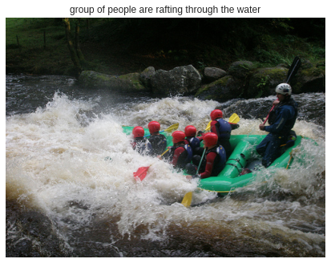
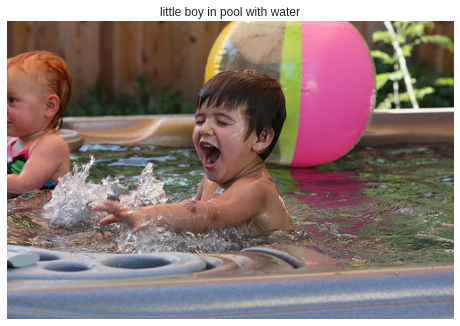
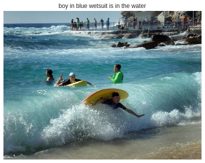
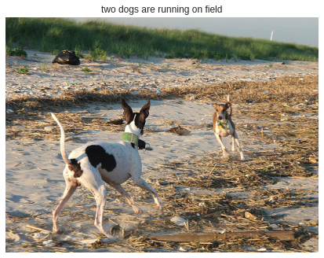

# IMAGE CAPTIONING

## What is Image Caption Generator?

Image caption generator is a task that involves computer vision and natural language processing concepts to recognize the context of an image and describe them in a natural language like English.


In this Python project, i have implemented the caption generator using **CNN (Convolutional Neural Networks)** and **LSTM (Long short term memory)** . The image features will be extracted from **Xception** which is a CNN model trained on the imagenet dataset and then we feed the features into the LSTM model which will be responsible for generating the image captions.

## Dataset

For the image caption generator, I have used the Flickr_8K dataset. There are also other big datasets like Flickr_30K and MSCOCO dataset but it can take weeks just to train the network so we will be using a small Flickr8k dataset. The advantage of a huge dataset is that we can build better models.

Thanks to **Jason Brownlee** for providing a direct link to download the dataset (Size: 1GB).

* [Flicker8k_Dataset](https://github.com/jbrownlee/Datasets/releases/download/Flickr8k/Flickr8k_Dataset.zip)

* [Flicker_8k_text](https://github.com/jbrownlee/Datasets/releases/download/Flickr8k/Flickr8k_text.zip)

The Flickr_8k_text folder contains file Flickr8k.token which is the main file of the dataset that contains image name and their respective captions separated by newline ```(“\n”)``` .

## Pre-requisites

This project requires good knowledge of Deep learning, Python, working on Jupyter notebooks, Keras library, Numpy, and Natural language processing.

## What is CNN ?

Convolutional Neural networks are specialized deep neural networks which can process the data that has input shape like a 2D matrix. Images are easily represented as a 2D matrix and CNN is very useful in working with images.
CNN is basically used for image classifications and identifying if an image is a bird, a plane or Superman, etc.

## What is LSTM ?
LSTM stands for Long short term memory, they are a type of RNN (recurrent neural network) which is well suited for sequence prediction problems. Based on the previous text, we can predict what the next word will be. It has proven itself effective from the traditional RNN by overcoming the limitations of RNN which had short term memory. LSTM can carry out relevant information throughout the processing of inputs and with a forget gate, it discards non-relevant information.

## Summary

Model depends on the data, so, it cannot predict the words that are out of its vocabulary. We used a small dataset consisting of 8000 images. For production-level models, we need to train on datasets larger than 100,000 images which can produce better accuracy models.

## Results





## Author

- **Mohd Aquib**